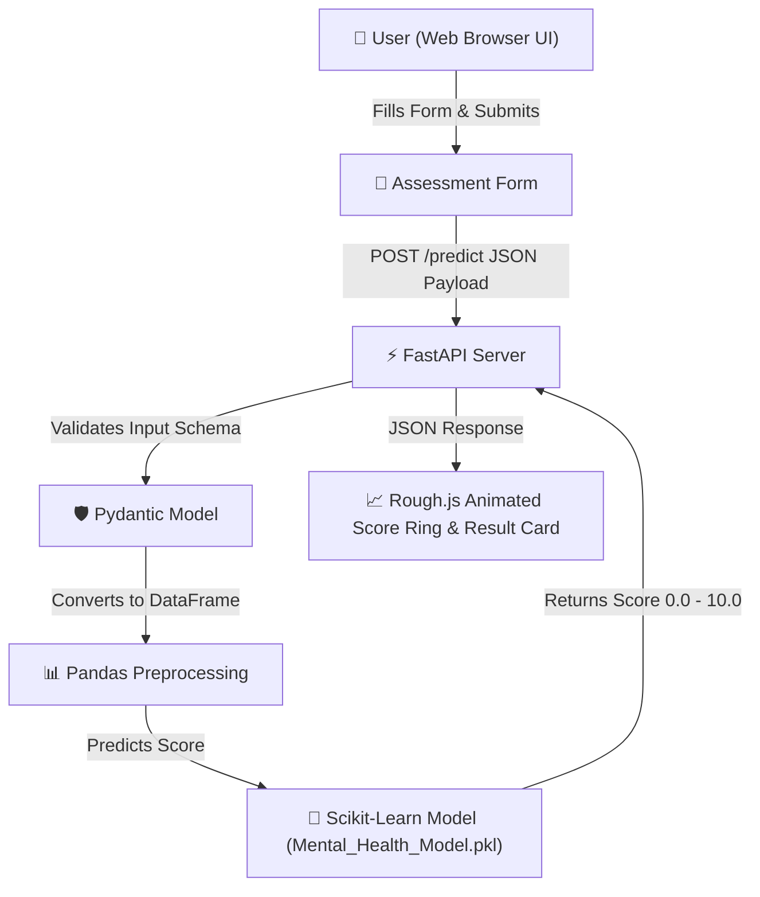

<div align="center">

# 🧠 Ledger — Mental Health Score Predictor

**A Machine Learning Web Application for Student Digital Habits & Mental Wellness Scoring**

[](https://python.org)
[](https://fastapi.tiangolo.com)
[](https://scikit-learn.org)
[](https://render.com)
[](LICENSE)

<br />

<p align="center">
  <i>"Your habits, scored, in one page."</i>
  <br />
  Ledger takes your daily sleep, screen time, phone unlocks, stress levels, and study load, passes them through a pre-trained <b>Random Forest Regressor</b> model, and hands back an instant, graded mental health score.
</p>

</div>

---

## 📌 Table of Contents
- [✨ Key Features](#-key-features)
- [🗺️ System Architecture](#️-system-architecture)
- [📊 Model & Dataset Features](#-model--dataset-features)
- [📈 Mental Health Score Ranges](#-mental-health-score-ranges)
- [🔌 API Reference](#-api-reference)
- [🚀 Local Installation & Setup](#-local-installation--setup)
- [☁️ Cloud Deployment (Render)](#️-cloud-deployment-render)
- [👨‍💻 Developer & Contacts](#-developer--contacts)

---

## ✨ Key Features

- 🌿 **Interactive Neo-Brutalist Interface**: Built with custom CSS design tokens, Rough.js SVG canvas doodles, and Caveat handwriting annotations.
- ⚡ **High-Performance FastAPI Backend**: Lightweight REST API served via Uvicorn with automated Pydantic schema validation.
- 🌲 **Scikit-Learn Random Forest Model**: Trained on comprehensive student social media & lifestyle survey datasets.
- 🛡️ **Zero Horizontal Overflow Layout**: Fully responsive, touch-friendly UI bounded for mobile, tablet, and desktop viewports.
- 🎨 **Dynamic Option Resolution**: Fetches categorical dropdowns dynamically from `/options` with pre-rendered HTML fallback.

---

## 🗺️ System Architecture



---

## 📊 Model & Dataset Features

The model evaluates **12 distinct lifestyle & digital habit parameters**:

| Feature Name | Type | Description / Options |
| :--- | :--- | :--- |
| `Age` | Integer | Age of student (10 – 100) |
| `Gender` | Categorical | `Male`, `Female` |
| `Country` | Categorical | `India`, `USA`, `Canada`, `Australia`, `UK`, `Germany`, `Mexico`, `Turkey`, `France`, `Other` |
| `Academic Level` | Categorical | `Undergraduate`, `Graduate`, `High School` |
| `Most-Used Platform` | Categorical | `Instagram`, `YouTube`, `TikTok`, `Facebook`, `WhatsApp`, `Snapchat`, `Twitter`, `LinkedIn`, `WeChat`, `LINE`, `KakaoTalk`, `VKontakte` |
| `Purpose of Use` | Categorical | `Networking`, `Education`, `Entertainment`, `News` |
| `Avg Daily Usage (hrs)`| Float | Daily screen time in hours (0.0 – 24.0) |
| `Daily Unlocks` | Integer | Total phone unlock count per day |
| `Study Hours` | Float | Hours spent studying per day (0.0 – 24.0) |
| `Physical Activity` | Float | Hours of movement or exercise per day |
| `Sleep per Night` | Float | Hours of sleep per night (0.0 – 24.0) |
| `Stress Level` | Categorical | `Low`, `Medium`, `High`, `Very High` |

---

## 📈 Mental Health Score Ranges

| Score Range | Tag Indicator | Explanation & Clinical Note |
| :--- | :--- | :--- |
| **8.0 – 10.0** | `looking solid ✓` | Strong habits. Sleep, activity, and stress balance reflect high well-being. |
| **6.0 – 7.9** | `steady ✓` | Healthy range. Small adjustments to sleep or screen time can improve score. |
| **4.0 – 5.9** | `worth a look ⚠️` | Lower end. High stress, heavy screen load, or insufficient sleep pulling score down. |
| **0.0 – 3.9** | `take this seriously 🔴` | Critical habit flags. Recommends reaching out to a support network or professional. |

---

## 🔌 API Reference

### 1. Serve Frontend
- **Endpoint**: `GET /`
- **Description**: Returns the single-page HTML interface (`index.html`).

### 2. Fetch Dropdown Options
- **Endpoint**: `GET /options`
- **Response**:
```json
{
  "countries": ["Other", "India", "USA", "Canada", "Australia", "UK", "Germany", "Mexico", "Turkey", "France"],
  "platforms": ["Facebook", "LinkedIn", "Instagram", "Snapchat", "Twitter", "YouTube", "TikTok", "LINE", "KakaoTalk", "VKontakte", "WhatsApp", "WeChat"],
  "academic_levels": ["Undergraduate", "Graduate", "High School"],
  "purposes": ["Networking", "Education", "Entertainment", "News"],
  "stress_levels": ["Low", "Medium", "High", "Very High"]
}
```

### 3. Predict Mental Health Score
- **Endpoint**: `POST /predict`
- **Request Body**:
```json
{
  "age": 21,
  "gender": "Male",
  "country": "India",
  "academic_level": "Undergraduate",
  "most_used_platform": "Instagram",
  "purpose_of_use": "Entertainment",
  "avg_daily_usage_hours": 3.5,
  "daily_unlocks": 45,
  "study_hours": 4.0,
  "physical_activity_hours": 1.0,
  "sleep_hours_per_night": 7.0,
  "stress_level": "Medium"
}
```
- **Response**:
```json
{
  "predicted_mental_health_score": 7.15
}
```

---

## 🚀 Local Installation & Setup

### Prerequisites
- Python **3.11+**
- Git

### Steps

```bash
# 1. Clone the repository
git clone https://github.com/shubham392007-sketch/Ledger-Mental_Health_Score_Model.git
cd Ledger-Mental_Health_Score_Model

# 2. Create and activate a virtual environment
python -m venv .venv
# On Windows:
.venv\Scripts\activate
# On macOS/Linux:
source .venv/bin/activate

# 3. Install required dependencies
pip install -r requirements.txt

# 4. Start the FastAPI server
uvicorn main:app --reload --host 127.0.0.1 --port 8000
```

Open your browser at **`http://127.0.0.1:8000`** to view the app!

---

## ☁️ Cloud Deployment (Render)

This repository is configured for one-click deployment on **Render**:

- **Runtime**: Python 3
- **Build Command**: `pip install -r requirements.txt`
- **Start Command**: `uvicorn main:app --host 0.0.0.0 --port $PORT`

---

## 👨‍💻 Developer & Contacts

<div align="center">

### Built by **Shubham Pokale**
*Passionate about Machine Learning, Full-Stack Engineering, and Intelligent Web Apps.*

<br/>

[](https://github.com/shubham392007-sketch)
[](https://www.linkedin.com/in/shubham-pokale-94030b37a)
[](https://www.instagram.com/shubhamofficial_2007/)
[](mailto:shubham392007@gmail.com)
[](https://x.com/SHUBHAM392007)

<br/>

**Built by Experience** • © 2026 Ledger — Mental Health Predictor

</div>
